# Lxylxy123456's GitHub Projects

## Table of Contents
Programs
* [zhalisp](#zhalisp)
* [algorithms](#algorithms)
* [ECS150Demo](#ecs150demo)
* [ECS160HW4](#ecs160hw4)

Scripts
* [cariboublocker](#cariboublocker)
* [turing-machine](#turing-machine)
* [flashplayer-update](#flashplayer-update)

Websites and APPs
* [shierquan](#shierquan)
* [container](#container)
* [chat-io](#chat-io)
* [FGFS-Controller](#fgfs-controller)
* [FGFSControllerWeb](#fgfscontrollerweb)
* [LocationTracker](#locationtracker)
* LocationTracker ([Web Version](#web-version))
* [hackdavis2019](#hackdavis2019)
* [lxylxy123456.github.io](#lxylxy123456githubio)

Tutorials and non-programs
* [HCCTalks](#hcctalks)
* [cs188](#cs188)
* [bresenham-logisim](#bresenham-logisim)
* [ECS175](#ecs175)
* [cs122b](#cs122b)
* [ECS132](#ecs132)

# Programs
## [zhalisp](https://github.com/lxylxy123456/zhalisp)
A "zha" CLISP interpreter implementation

Two versions, written in C++ (3000 LOC) and Python (1300 LOC). 

Features (C++): garbage collection, tail call optimization, call stack limitation

Demo:

Default options
```
$ cd cpp; make > /dev/null
$ ./backend
-> (+ 1 2 (* 3 4))
=> 15
-> (defun factorial (x cur)
    (if (zerop x) cur (factorial (1- x) (* cur x))))
=> FACTORIAL
-> (factorial 5 1)
=> 120
-> (factorial 9999 1)
Segmentation fault (core dumped)
```
Enable stack limitation (`make LS=1`)
```
-> (defun factorial (x cur)
    (if (zerop x) cur (factorial (1- x) (* cur x))))
=> FACTORIAL
-> (factorial 9999 1)
Error: Stack overflow
-> (exit)
```
Enable tail call optimization (`make TR=1`)
```
-> (defun factorial (x cur)
    (if (zerop x) cur (factorial (1- x) (* cur x))))
=> FACTORIAL
-> (/ (factorial 9999 1) (factorial 9997 1))
=> 99970002
-> (* 9998 9999)
=> 99970002
-> 
```

## [algorithms](https://github.com/lxylxy123456/algorithms)
Personal implementation of some algorithms in "[Introduction to Algorithms](https://mitpress.mit.edu/books/introduction-algorithms-third-edition)", third edition

Written in C++, extensively using templates to support any data type, 20000 LOC

Contains 224 functions (e.g. `LeftRotate`, `RightRotate`, `RBInsert`) from 91 topics (e.g. `RedBlackTree`). 

All algorithms have unit tests. The project uses GitHub Actions for Continuous Integration. 

Demo: Red-Black Tree
```
$ make bin/RedBlackTreeMain
$ bin/RedBlackTreeMain
>> i
k = 1
>> i
k = 2
>> i
k = 3
>> p
  2  
 / \ 
1   3
>> i
k = 4
>> i
k = 5
>> i
k = 6
>> p
  2       
 /  \     
1    4    
    / \   
   3   5  
        \ 
         6
>> 
```

## [ECS150Demo](https://github.com/lxylxy123456/ECS150Demo)
Some demo programs related to the operating systems class ([ECS 150](https://www.cs.ucdavis.edu/blog/ecs-150-operating-systems-system-programming/))

* `sync_barrier.py`: synchronization barrier implemented using semaphores

* `page2frame.py`: Translate (virtual) page to (physical) frame using Linux's process information pseudo-filesystem
```
$ sudo python3 page2frame.py | hexdump | head -n 4
gcc -o page2frame page2frame.c
Virtual memory mapping found:
 ['7f1b78163000-7f1b78164000', '-w-p', '00000000', '00:00', '0']
PFN: 0x16bd21
Flags: 0000000000000000000000000000000000000000000000000101100001001000
0000000 0000 0001 0002 0003 0004 0005 0006 0007
0000010 0008 0009 000a 000b 000c 000d 000e 000f
0000020 0010 0011 0012 0013 0014 0015 0016 0017
0000030 0018 0019 001a 001b 001c 001d 001e 001f
$ 
```

* `page_table.py`: Draw the page table of a process from `/proc/[pid]/maps`
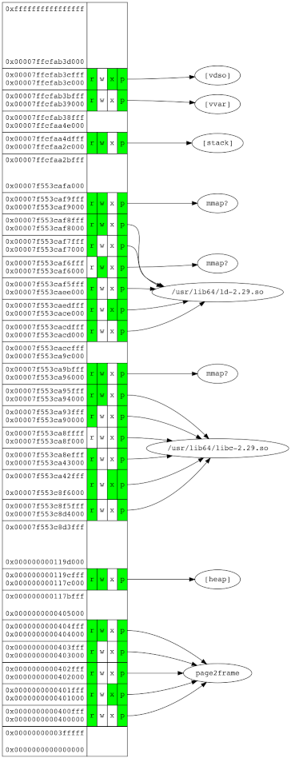

## [ECS160HW4](https://github.com/lxylxy123456/ECS160HW4)
A (possibly) flawless C program that calculates the top 10 tweeters (by volume of tweets) in a given CSV file of tweets. Submitted for Homework 4 of [ECS 160](https://www.cs.ucdavis.edu/blog/ecs-160-software-engineering/) Fall 2019. 

Contributers: Eric Li, Kevin Rong

```sh
$ cat > a.csv
id,name,content
1,lxylxy123456,I love programming
2,lxylxy123456,I like open source
3,rkevin-arch,I am a contributer of this repo
4,anonymous,blah blah blah
$ ./maxTweeter a.csv
lxylxy123456: 2
rkevin-arch: 1
anonymous: 1
$ 
```

# Scripts
## [cariboublocker](https://github.com/lxylxy123456/cariboublocker)
Enhanced [keringar/cariboublocker](https://github.com/keringar/cariboublocker) to support Gnome Shell 3.36

Download: https://extensions.gnome.org/extension/3222/block-caribou-36/

Download page screenshot:

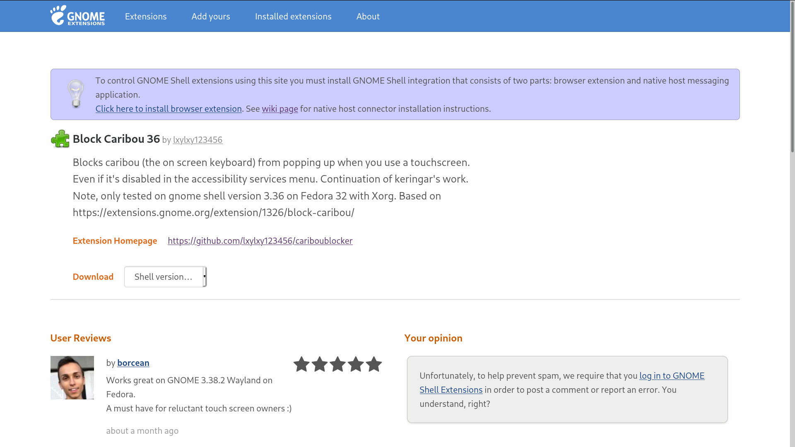

## [turing-machine](https://github.com/lxylxy123456/turing-machine)
Python implementation of DFA and Turing Machine

DFA Demo: test whether the input binary string represents a number divisible by 3

* Specification
```
DFA_3mod = {
	'Sigma': 	(0, 1), 
	'Q': 		('A', 'B', 'C'), 
	'q0':		'A', 
	'F': 		('A',), 
	'delta': 	{
					('A', 0): 'A', 
					('A', 1): 'B', 
					('B', 0): 'C', 
					('B', 1): 'A', 
					('C', 0): 'B', 
					('C', 1): 'C', 
				}, 
}
```
* Plot

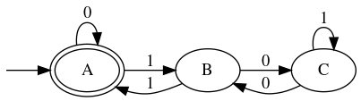
* Execution
```
A B C B A A B C C B A A
 1 0 0 1 0 1 0 1 0 1 0
True
```

Turing Machine Demo: [2nd busy beaver](https://en.wikipedia.org/wiki/Busy_beaver#Examples)

* Specification
```
TM_bb2 = {
	'Q': 		('A', 'B', 'H'), 
	'Gamma': 	(0, 1), 
	'b': 		0, 
	'Sigma': 	(1, ), 
	'q0':		'A', 
	'F': 		('H'), 
	'R': 		(), 
	'delta': 	{
					('A', 0): ('B', 1, R), 
					('A', 1): ('B', 1, L), 
					('B', 0): ('A', 1, L), 
					('B', 1): ('H', 1, R), 
				}, 
}
TT_bb2 = (0, )
```
* Plot

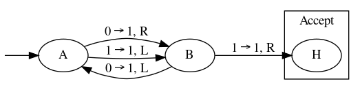
* Execution
```
A	 0 0(0)0 0 
B	 0 0 1(0)0 
A	 0 0(1)1 0 
B	 0(0)1 1 0 
A	(0)1 1 1 0 
B	 1(1)1 1 0 
H	 1 1(1)1 0 
True	6	 1 1(1)1 
```

## [flashplayer-update](https://github.com/lxylxy123456/flashplayer-update)
Automatically Install the Flash plugin for Mozilla Firefox on Linux

```
$ ls /usr/lib64/mozilla/plugins/libflashplayer.so
ls: cannot access '/usr/lib64/mozilla/plugins/libflashplayer.so': No such file or directory
$ sudo python3 flashplayer.py
Installed
Updated version record
$ ls /usr/lib64/mozilla/plugins/libflashplayer.so
/usr/lib64/mozilla/plugins/libflashplayer.so
$ sudo python3 flashplayer.py
Installed version is latest
$ 
```

# Websites and APPs
## [shierquan](https://github.com/lxylxy123456/shierquan)
An easy event publication & management platform

Visit:
[中文](https://zh.shierquan.ercli.dev/) / 
[English](https://en.shierquan.ercli.dev/) / 
[日本語](https://ja.shierquan.ercli.dev/) (static texts only)

[Django](https://www.djangoproject.com/) + 
[BootStrap](https://getbootstrap.com/) + 
[PostgreSQL](https://www.postgresql.org) + 
[Apache](https://httpd.apache.org/)

Major contributers: lxylxy123456, David Ma

Chinese home page:


Chinese club info page:


English home page:


Japanese home page:


## container
A file storage service

Visit: [https://c.ercli.dev/](https://c.ercli.dev/)
 (any username / password combination will work)

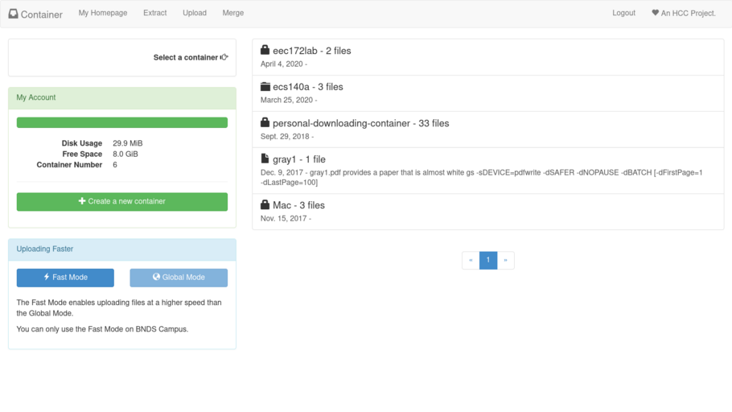

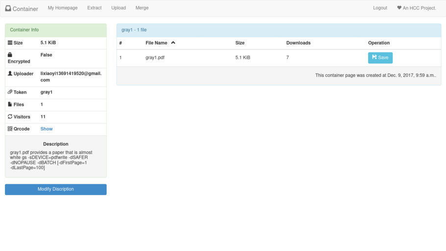

## chat-io
An instant messaging platform

Visit: [https://ercli.dev/](https://ercli.dev/)

(enter your name in "输入你的姓名", click "进入对话", then on the next page
 leave Session ID and Session Token blank, and click "进入对话" directly)

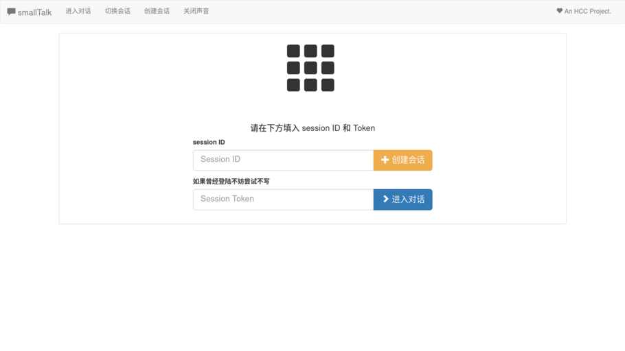


## [FGFS-Controller](https://github.com/lxylxy123456/FGFS-Controller)
An iOS app that controls a flight simulator
 ([FGFS](https://www.flightgear.org/)) on a computer.

Aileron, elevator, rudder, and throttle can be controlled.

Data are collected through accelerometer in the iOS device, and transmitted
 using UDP packets.


## [FGFSControllerWeb](https://github.com/lxylxy123456/FGFSControllerWeb)
A web app with similar functionality

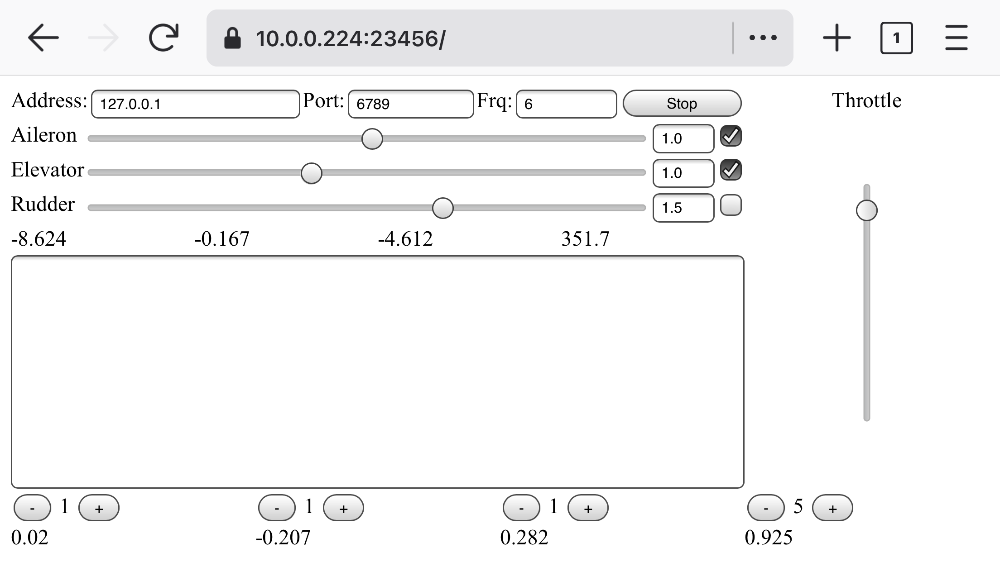

A new throttle control UI:

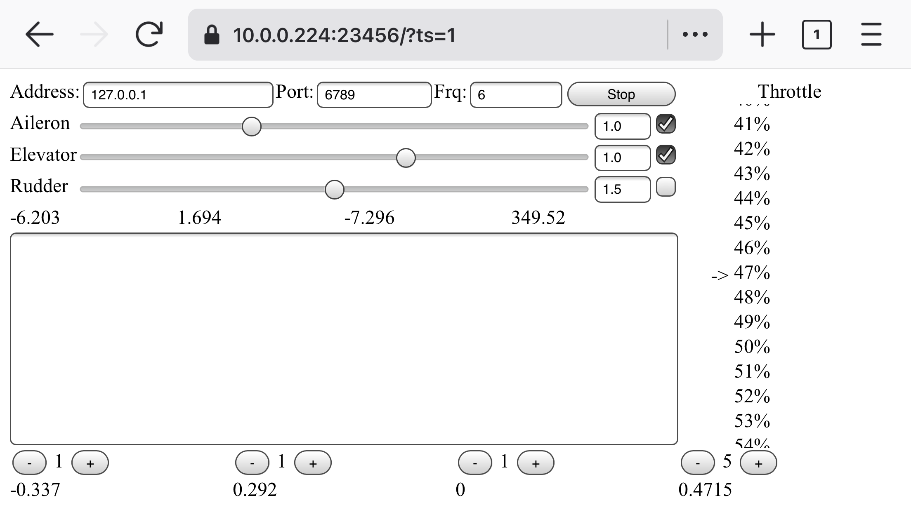

Receiver (made with pygame):

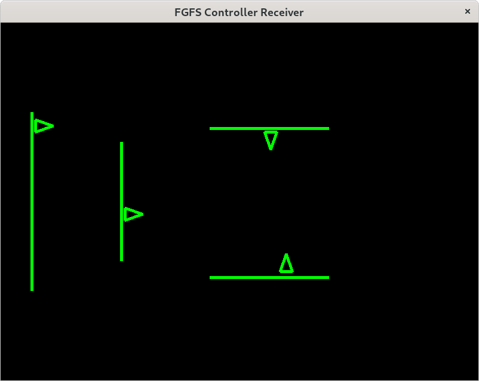

## [LocationTracker](https://github.com/lxylxy123456/LocationTracker)
An iOS APP that track the location of an iPhone

In cable car:


In high-speed rail:

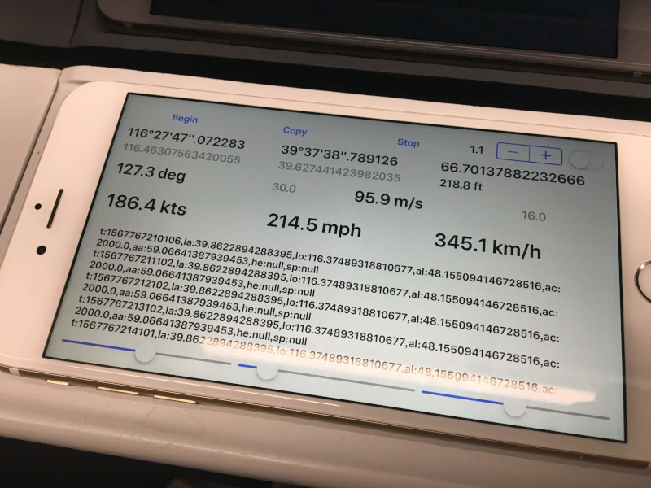

In plane:


### Web Version
A web app with similar functionality is available at: [https://ercli.dev/ll.html](https://ercli.dev/ll.html)

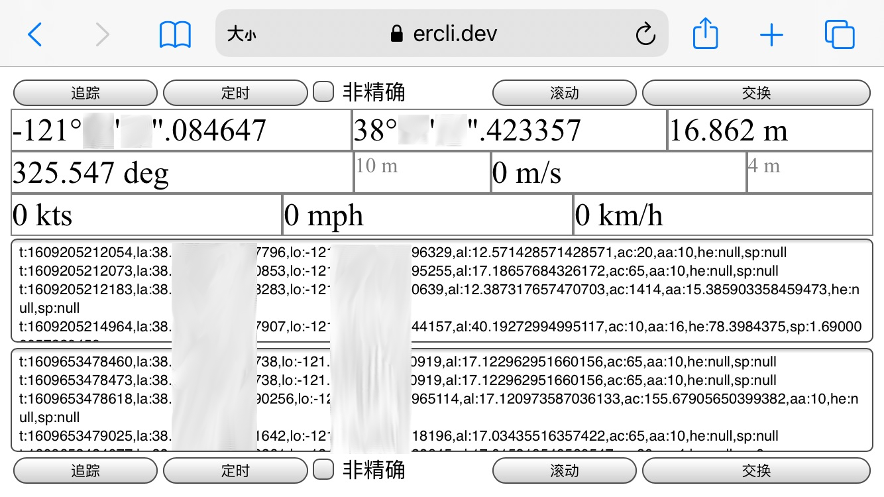

## [hackdavis2019](https://github.com/lxylxy123456/hackdavis2019)
Hack Davis 2019 project

Authors: lxylxy123456, Yiling Chen, jingyizhu, wyr

[http://savemyschedule.ercli.dev/](http://savemyschedule.ercli.dev/)

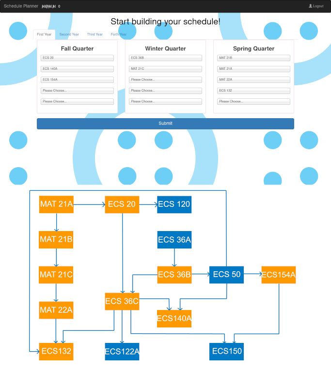

## [lxylxy123456.github.io](https://github.com/lxylxy123456/lxylxy123456.github.io)
My [homepage](https://lxylxy123456.github.io) (this website)

# Tutorials and non-programs
## [HCCTalks](https://github.com/lxylxy123456/HCCTalks)
Some programming related tutorials in Chinese, written in XeLaTeX

Download page: [https://github.com/lxylxy123456/HCCTalks/releases/latest](https://github.com/lxylxy123456/HCCTalks/releases/latest) (supports 4:3 or 16:9 aspect ratio)

Screenshot (from PythonTalk{[02](https://github.com/lxylxy123456/HCCTalks/blob/make/43/PythonTalk02.pdf),[11](https://github.com/lxylxy123456/HCCTalks/blob/make/43/PythonTalk11.pdf)}, BashTalk[02](https://github.com/lxylxy123456/HCCTalks/blob/make/43/BashTalk02.pdf), RegExpTalk[01](https://github.com/lxylxy123456/HCCTalks/blob/make/43/RegExpTalk01.pdf)):

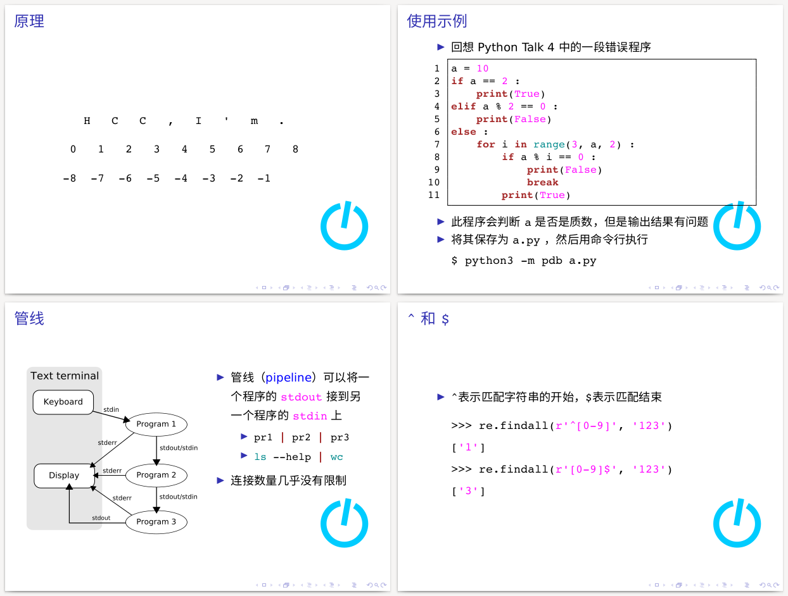

## [cs188](https://github.com/lxylxy123456/cs188)
[ECS 188: Ethics in an Age of Technology](https://cs.ucdavis.edu/schedules-classes/ecs-188-ethics-age-technology) paper and presentation

Presentation Video on [YouTube](http://www.youtube.com/watch?v=vFygLeyNd1o):

[](http://www.youtube.com/watch?v=vFygLeyNd1o)

Screenshot of presentation slides (left) and paper (right):

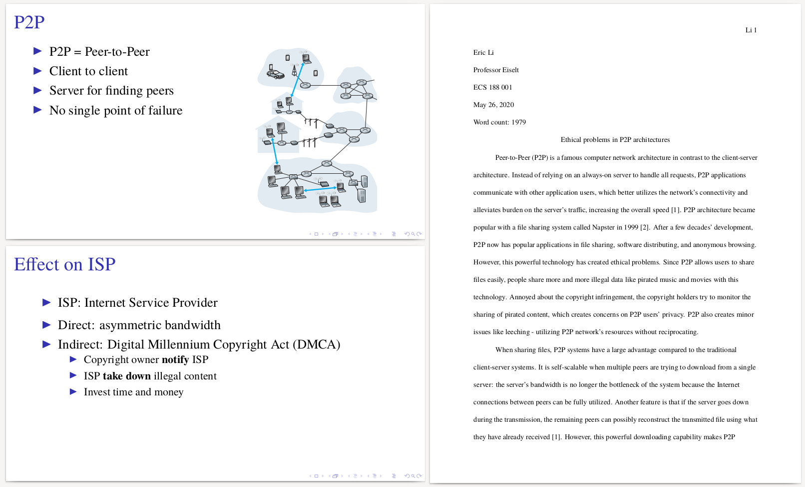

## [bresenham-logisim](https://github.com/lxylxy123456/bresenham-logisim)
Implementation of Bresenham's line algorithm using logisim (logic circuit)

GIF demo [here](https://github.com/lxylxy123456/bresenham-logisim#demo).


## [ECS175](https://github.com/lxylxy123456/ECS175)
[Computer Graphics class](https://www.cs.ucdavis.edu/blog/ecs-175-computer-graphics/) homework demo

Complete list of demos [here](https://github.com/lxylxy123456/ECS175#demos)

Phong lighting & Ray tracing demo:

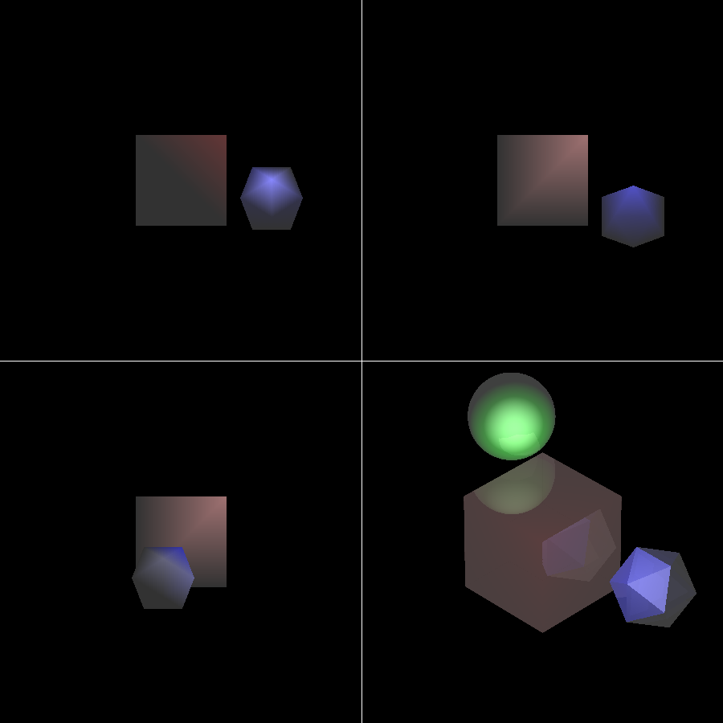

(The green sphere is expected to be only visible in the lower-right screen)

Bezier & B-spline curve demo:

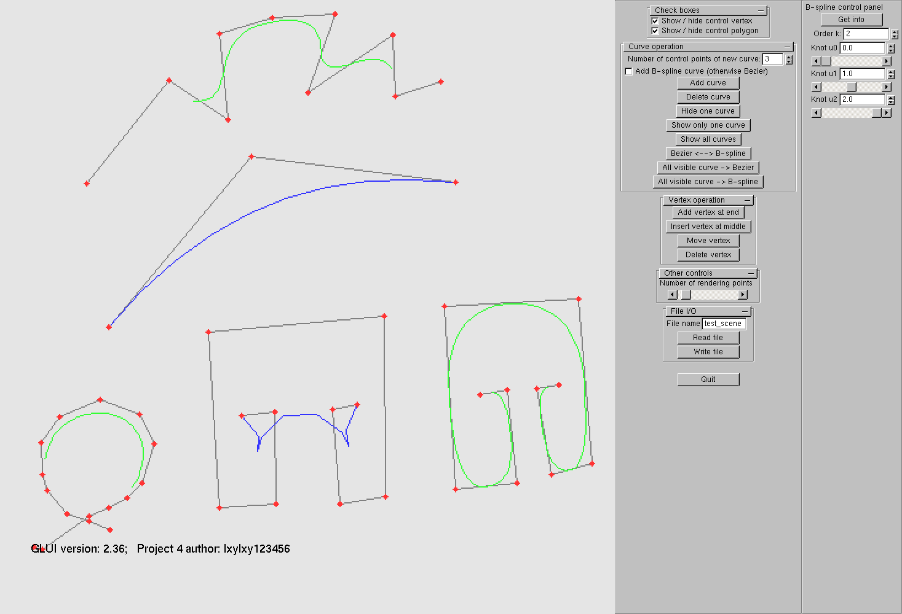

## [cs122b](https://github.com/lxylxy123456/cs122b)
A randomized algorithm analysis related to [ECS 122B](https://www.cs.ucdavis.edu/blog/ecs-122b-algorithm-design-analysis/), written in LaTeX

Screenshot:

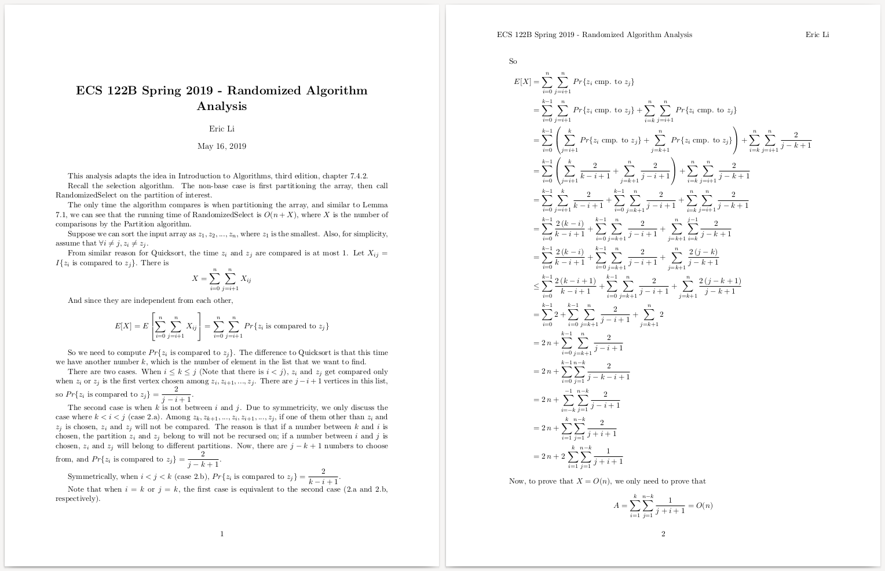

## [ECS132](https://github.com/lxylxy123456/ECS132)
[ECS 132: Probability & Statistical Modeling for Computer Science class](https://cs.ucdavis.edu/schedules-classes/ecs-132-probability-statistical-modeling-computer-science) term project paper

Group members: Eric Li, Benjamin Bing, Zhiyuan Guo

Screenshot:

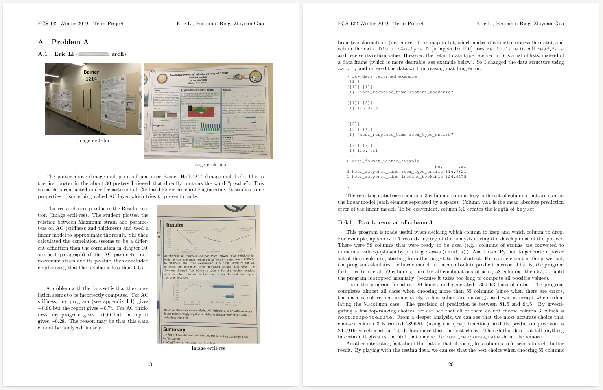

