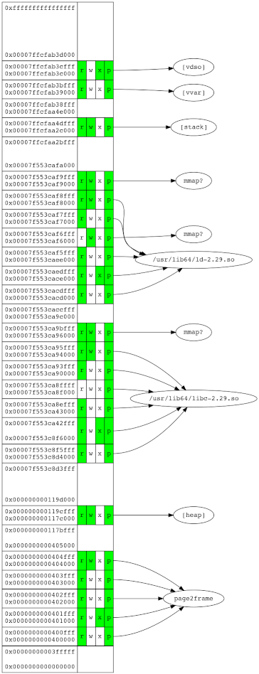
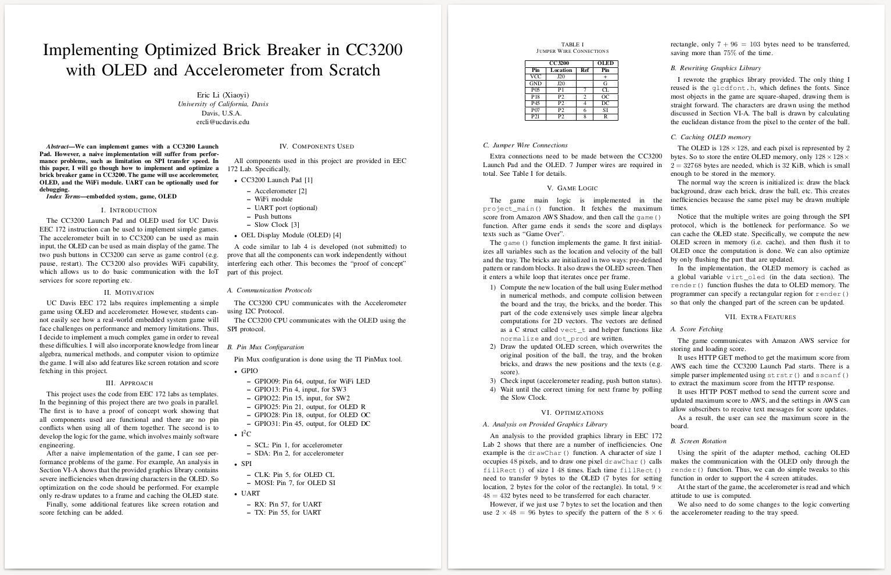

## [zhalisp](https://github.com/lxylxy123456/zhalisp)
A "zha" CLISP interpreter implementation

Two versions, written in C++ (3000 LOC) and Python (1300 LOC). 

Features (C++): garbage collection, tail call optimization, call stack limitation

Demo:

Default options
```
$ cd cpp; make > /dev/null
$ ./backend
-> (+ 1 2 (* 3 4))
=> 15
-> (defun factorial (x cur)
    (if (zerop x) cur (factorial (1- x) (* cur x))))
=> FACTORIAL
-> (factorial 5 1)
=> 120
-> (factorial 9999 1)
Segmentation fault (core dumped)
```
Enable stack limitation (`make LS=1`)
```
-> (defun factorial (x cur)
    (if (zerop x) cur (factorial (1- x) (* cur x))))
=> FACTORIAL
-> (factorial 9999 1)
Error: Stack overflow
-> (exit)
```
Enable tail call optimization (`make TR=1`)
```
-> (defun factorial (x cur)
    (if (zerop x) cur (factorial (1- x) (* cur x))))
=> FACTORIAL
-> (/ (factorial 9999 1) (factorial 9997 1))
=> 99970002
-> (* 9998 9999)
=> 99970002
-> 
```

<hr />

## [algorithms](https://github.com/lxylxy123456/algorithms)
Personal implementation of some algorithms in "[Introduction to Algorithms](https://mitpress.mit.edu/books/introduction-algorithms-third-edition)", third edition

Written in C++, extensively using templates to support any data type, 20000 LOC

Contains 224 functions (e.g. `LeftRotate`, `RightRotate`, `RBInsert`) from 91 topics (e.g. `RedBlackTree`). 

All algorithms have unit tests. The project uses GitHub Actions for Continuous Integration. 

Demo: Red-Black Tree
```
$ make bin/RedBlackTreeMain
$ bin/RedBlackTreeMain
>> i
k = 1
>> i
k = 2
>> i
k = 3
>> p
  2  
 / \ 
1   3
>> i
k = 4
>> i
k = 5
>> i
k = 6
>> p
  2       
 /  \     
1    4    
    / \   
   3   5  
        \ 
         6
>> 
```

<hr />

## [ECS150Demo](https://github.com/lxylxy123456/ECS150Demo)
Some demo programs related to the operating systems class ([ECS 150](https://www.cs.ucdavis.edu/blog/ecs-150-operating-systems-system-programming/))

* `sync_barrier.py`: synchronization barrier implemented using semaphores

* `page2frame.py`: Translate (virtual) page to (physical) frame using Linux's process information pseudo-filesystem
```
$ sudo python3 page2frame.py | hexdump | head -n 4
gcc -o page2frame page2frame.c
Virtual memory mapping found:
 ['7f1b78163000-7f1b78164000', '-w-p', '00000000', '00:00', '0']
PFN: 0x16bd21
Flags: 0000000000000000000000000000000000000000000000000101100001001000
0000000 0000 0001 0002 0003 0004 0005 0006 0007
0000010 0008 0009 000a 000b 000c 000d 000e 000f
0000020 0010 0011 0012 0013 0014 0015 0016 0017
0000030 0018 0019 001a 001b 001c 001d 001e 001f
$ 
```

* `page_table.py`: Draw the page table of a process from `/proc/[pid]/maps`


<hr />

## [eec172](https://github.com/lxylxy123456/eec172)
Brick Breaker game implemented in Python, C (XLib, Linux), and C (CC3200, Texas Instruments)

Screenshot of C version (XLib, Linux):


Demo video on CC3200:

[](https://www.youtube.com/watch?v=uDkXkYqYVf0)

Screenshot of final report:



<hr />

## [ECS160HW4](https://github.com/lxylxy123456/ECS160HW4)
A (possibly) flawless C program that calculates the top 10 tweeters (by volume of tweets) in a given CSV file of tweets. Submitted for Homework 4 of [ECS 160](https://www.cs.ucdavis.edu/blog/ecs-160-software-engineering/) Fall 2019. 

Contributers: Eric Li, Kevin Rong

```sh
$ cat > a.csv
id,name,content
1,lxylxy123456,I love programming
2,lxylxy123456,I like open source
3,rkevin-arch,I am a contributer of this repo
4,anonymous,blah blah blah
$ ./maxTweeter a.csv
lxylxy123456: 2
rkevin-arch: 1
anonymous: 1
$ 
```

