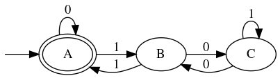
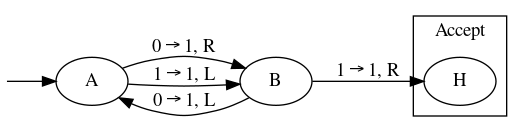

## [cariboublocker](https://github.com/lxylxy123456/cariboublocker)
Enhanced [keringar/cariboublocker](https://github.com/keringar/cariboublocker) to support Gnome Shell 3.36

Download: [https://extensions.gnome.org/extension/3222/block-caribou-36/](https://extensions.gnome.org/extension/3222/block-caribou-36/)

Download page screenshot:


## [turing-machine](https://github.com/lxylxy123456/turing-machine)
Python implementation of DFA and Turing Machine

DFA Demo: test whether the input binary string represents a number divisible by 3

* Specification
```
DFA_3mod = {
	'Sigma': 	(0, 1), 
	'Q': 		('A', 'B', 'C'), 
	'q0':		'A', 
	'F': 		('A',), 
	'delta': 	{
					('A', 0): 'A', 
					('A', 1): 'B', 
					('B', 0): 'C', 
					('B', 1): 'A', 
					('C', 0): 'B', 
					('C', 1): 'C', 
				}, 
}
```
* Plot


* Execution
```
A B C B A A B C C B A A
 1 0 0 1 0 1 0 1 0 1 0
True
```

Turing Machine Demo: [2nd busy beaver](https://en.wikipedia.org/wiki/Busy_beaver#Examples)

* Specification
```
TM_bb2 = {
	'Q': 		('A', 'B', 'H'), 
	'Gamma': 	(0, 1), 
	'b': 		0, 
	'Sigma': 	(1, ), 
	'q0':		'A', 
	'F': 		('H'), 
	'R': 		(), 
	'delta': 	{
					('A', 0): ('B', 1, R), 
					('A', 1): ('B', 1, L), 
					('B', 0): ('A', 1, L), 
					('B', 1): ('H', 1, R), 
				}, 
}
TT_bb2 = (0, )
```
* Plot


* Execution
```
A	 0 0(0)0 0 
B	 0 0 1(0)0 
A	 0 0(1)1 0 
B	 0(0)1 1 0 
A	(0)1 1 1 0 
B	 1(1)1 1 0 
H	 1 1(1)1 0 
True	6	 1 1(1)1 
```

## [flashplayer-update](https://github.com/lxylxy123456/flashplayer-update)
Automatically Install the Flash plugin for Mozilla Firefox on Linux

```
$ ls /usr/lib64/mozilla/plugins/libflashplayer.so
ls: cannot access '/usr/lib64/mozilla/plugins/libflashplayer.so': No such file or directory
$ sudo python3 flashplayer.py
Installed
Updated version record
$ ls /usr/lib64/mozilla/plugins/libflashplayer.so
/usr/lib64/mozilla/plugins/libflashplayer.so
$ sudo python3 flashplayer.py
Installed version is latest
$ 
```

